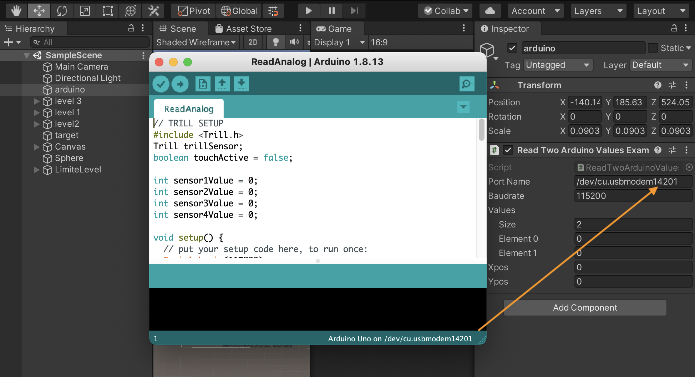

## Introduction
En tant qu’étudiant en design d’interactivité, je devais faire un jeu vidéo grâce à Unity et avec Arduino imaginer un gameplay et sa manette de jeu. C’était la première fois qu’on me demandait de concevoir un jeu avec cet IDE Je pensais au début à un jeu inspiré de Angry Birds ou Monument Valley. 

## Gameplay
Au niveau du gameplay, il suffit de détruire les structures à l’aide d’un lancer de la balle. Ici avec le trill, glissez le doigt pour lancer la balle. 

## Les pré-requis
Pour jouer à ce jeu vous allez avoir besoin de :
- [Trill square](http://shop.bela.io/products/trill-square)
- [Une carte Arduino](https://store.arduino.cc/arduino-uno-rev3)

Pour le branchement du Trill, suivez cette installation.


- Cable Rouge - 5v
- Cable Jaune - A5
- Cable Blanc - A4
- Cable Noir. - GND

Entrez le port connexion indiqué dans l’[IDE Arduino](https://www.arduino.cc/en/software) dans Unity. 



*Note : Le port de connexion change chaque fois que la carte Arduino est débranché. Cette étape est donc indispensable avant de jouer avec le trill.*

Une fois ceci fait, vous pouvez jouer à CubeCube. 


## Les possibles bugs
Ce jeu n’est pas encore totalement terminé. Certains bugs sont encore présents. 
- La balle va sortir de manière aléatoire du jeu au moment du lancer. 
- Une fois la structure heurtée, les cubes appliquent un transforme XYZ ce qui est bizarre.

## Encore une petite chose
- ```Limite Level``` limite la map du jeu pour éviter que la balle aille trop loin. 
- Le fichier ```OneValue/ReadTwoArduinoValuesExample.cs``` gère la connexion entre Unity et Arduino.
- ```arduino/testReadAnalog/ReadAnalog/ReadAnalog.ino``` est le fichier arduino qui gère le nombre de touch possible.
- Aller dans ```arduino/Library/trill``` si vous voulez installer la librarie Trill dans l'IDE Arduino. [plus d'infos](https://www.arduino.cc/en/guide/libraries).

## Remerciements 
Sans l’aide de Martin et de Bérenger, ce jeu aurait été  difficilement possible. Un grand merci à eux. 


